Every image below is the real file the game loads, shown at its full size.

> **These are placeholders.** The art is deliberately flat and simple: blocks in a shared
> frontier palette, readable at RimWorld's zoom, consistent from one building to the next. It is
> drawn to a recipe rather than by hand, which is why every building has art at every facing and
> none of them borrow a picture from something else.

## Buildings

Each building has four pictures, one per direction it can face. The one shown in the build menu
is the north view.

### Shop counter

2 × 1 tiles · [details](buildings.md#shop-counter)

  <figure class="art-tile">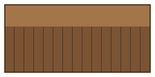<figcaption>north · 256 × 128 also the build-menu icon</figcaption></figure>
  <figure class="art-tile">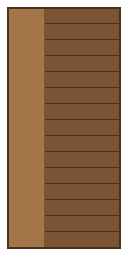<figcaption>east · 128 × 256</figcaption></figure>
  <figure class="art-tile">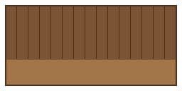<figcaption>south · 256 × 128</figcaption></figure>
  <figure class="art-tile">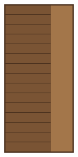<figcaption>west · 128 × 256</figcaption></figure>

Plain oiled wood, no accent stripe. The lighter band along the far edge is the counter's
serving surface; the vertical seams are planks.

  <code>#A3764A</code> surface
  <code>#7A5434</code> body
  <code>#4A311E</code> edge

### Saloon bar

2 × 1 tiles · [details](buildings.md#saloon-bar)

  <figure class="art-tile">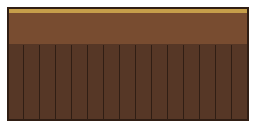<figcaption>north · 256 × 128 also the build-menu icon</figcaption></figure>
  <figure class="art-tile">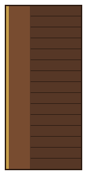<figcaption>east · 128 × 256</figcaption></figure>
  <figure class="art-tile">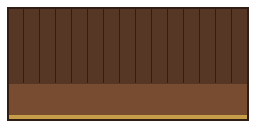<figcaption>south · 256 × 128</figcaption></figure>
  <figure class="art-tile">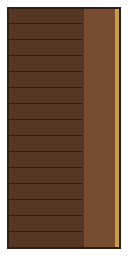<figcaption>west · 128 × 256</figcaption></figure>

Darker wood than the shop counter, and the only building with an **accent stripe** — the brass
rail running just inside the top edge. That stripe is the one thing distinguishing a bar from a
counter at a glance, which is why it exists.

  <code>#C69E4A</code> accent (brass rail)
  <code>#784C30</code> surface
  <code>#563726</code> body
  <code>#301E14</code> edge

### Barber chair

2 × 1 tiles · [details](buildings.md#barber-chair)

  <figure class="art-tile">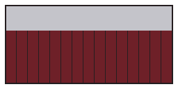<figcaption>north · 256 × 128 also the build-menu icon</figcaption></figure>
  <figure class="art-tile">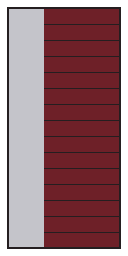<figcaption>east · 128 × 256</figcaption></figure>
  <figure class="art-tile">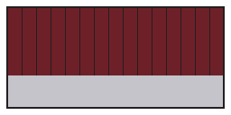<figcaption>south · 256 × 128</figcaption></figure>
  <figure class="art-tile">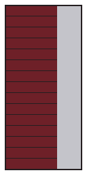<figcaption>west · 128 × 256</figcaption></figure>

The odd one out, and deliberately so. Red leather rather than wood, a neutral charcoal outline
rather than a brown one, and a pale band that reads as a **mirror** rather than as lit timber.
This is why each building's colours are written down separately instead of being shaded
automatically from one base colour: automatic shading would have made the barber a red counter.

  <code>#C4C4CA</code> surface (mirror)
  <code>#6E2028</code> body
  <code>#241E20</code> edge

### Hotel desk

2 × 1 tiles · [details](buildings.md#hotel-desk)

  <figure class="art-tile">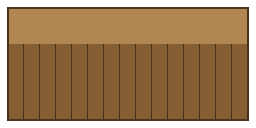<figcaption>north · 256 × 128 also the build-menu icon</figcaption></figure>
  <figure class="art-tile">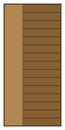<figcaption>east · 128 × 256</figcaption></figure>
  <figure class="art-tile">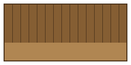<figcaption>south · 256 × 128</figcaption></figure>
  <figure class="art-tile">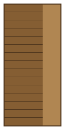<figcaption>west · 128 × 256</figcaption></figure>

Warmer and lighter than the shop counter's own wood, and — like every counter here except the
saloon — no accent stripe.

  <code>#B08652</code> surface
  <code>#855E33</code> body
  <code>#4C341C</code> edge

### Hotel bed

1 × 2 tiles · [details](buildings.md#hotel-bed)

  <figure class="art-tile">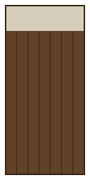<figcaption>north · 128 × 256 also the build-menu icon</figcaption></figure>
  <figure class="art-tile">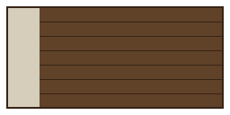<figcaption>east · 256 × 128</figcaption></figure>
  <figure class="art-tile">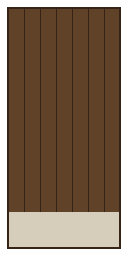<figcaption>south · 128 × 256</figcaption></figure>
  <figure class="art-tile">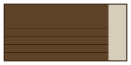<figcaption>west · 256 × 128</figcaption></figure>

The one counter-family building drawn on its side — a bed is longer than it is wide, so its north
and south facings are the tall ones instead. The pale band reads as bedding rather than as a
counter's serving surface.

  <code>#D6CDBA</code> surface (bedding)
  <code>#604228</code> body
  <code>#362416</code> edge

### Sheriff's office

2 × 1 tiles · [details](buildings.md#sheriffs-office)

  <figure class="art-tile">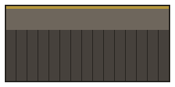<figcaption>north · 256 × 128 also the build-menu icon</figcaption></figure>
  <figure class="art-tile">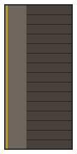<figcaption>east · 128 × 256</figcaption></figure>
  <figure class="art-tile">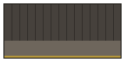<figcaption>south · 256 × 128</figcaption></figure>
  <figure class="art-tile">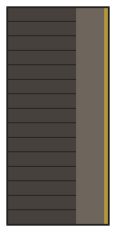<figcaption>west · 128 × 256</figcaption></figure>

Grey-brown rather than any counter's oiled wood — desk and gun-metal rather than a serving
surface — with the same brass the faro table's dealing box uses for its one warm accent: here,
the rifle rack.

  <code>#B4963C</code> accent (rifle rack)
  <code>#6E665C</code> surface
  <code>#46413C</code> body
  <code>#23201C</code> edge

### Coach depot

3 × 2 tiles · [details](buildings.md#coach-depot)

  <figure class="art-tile art-wide">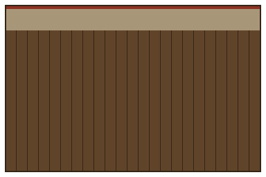<figcaption>north · 384 × 256 also the build-menu icon</figcaption></figure>
  <figure class="art-tile art-wide">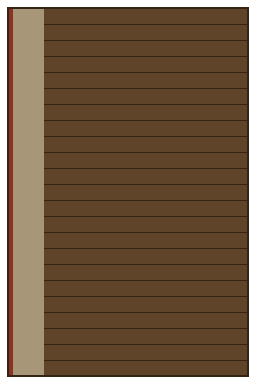<figcaption>east · 256 × 384</figcaption></figure>
  <figure class="art-tile art-wide">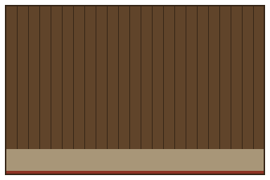<figcaption>south · 384 × 256</figcaption></figure>
  <figure class="art-tile art-wide">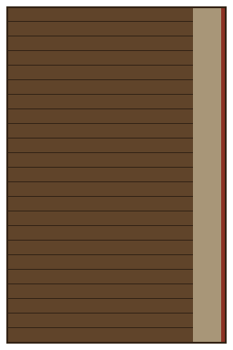<figcaption>west · 256 × 384</figcaption></figure>

A saddle-leather brown, distinct from every other palette in the set — warmer than the sheriff's
office's gun-metal grey, redder than any counter's oiled wood — with a dusty road-tan surface
band and an oxide-red accent stripe standing in for the ticket window's own paintwork.

  <code>#8C3224</code> accent (ticket window)
  <code>#A89678</code> surface
  <code>#60442A</code> body
  <code>#342416</code> edge

## Main street

Four decorative pieces, plus the false front's own small mechanical effect. See
[buildings](buildings.md#main-street) for what each one actually does. The **faro table** shares
this palette and these texture files — it was drawn here in stage 6, before it was a business —
but it's since been promoted into a real gambling hall; see [buildings](buildings.md#faro-table)
for what it does now.

### False front

3 × 1 tiles (drawn taller than its footprint) · [details](buildings.md#false-front)

  <figure class="art-tile art-wide">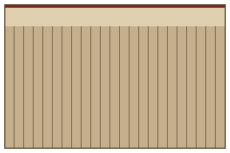<figcaption>north · 384 × 256 also the build-menu icon</figcaption></figure>
  <figure class="art-tile art-wide">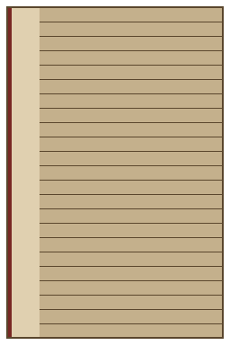<figcaption>east · 256 × 384</figcaption></figure>
  <figure class="art-tile art-wide">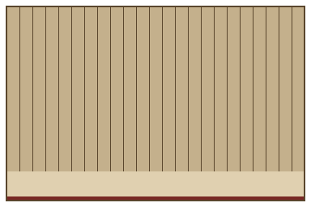<figcaption>south · 384 × 256</figcaption></figure>
  <figure class="art-tile art-wide">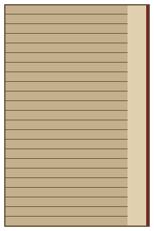<figcaption>west · 256 × 384</figcaption></figure>

The only building drawn deliberately larger than the ground it occupies — a false front is
supposed to tower over the room behind it. A dark red accent stripe stands in for the painted
sign along the top.

  <code>#782824</code> accent (painted sign)
  <code>#E0D0B0</code> surface
  <code>#C4B08C</code> body
  <code>#5A462D</code> edge

### Hitching post

2 × 1 tiles · [details](buildings.md#hitching-post)

  <figure class="art-tile">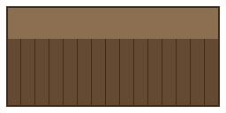<figcaption>north · 256 × 128 also the build-menu icon</figcaption></figure>
  <figure class="art-tile">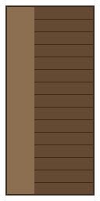<figcaption>east · 128 × 256</figcaption></figure>
  <figure class="art-tile">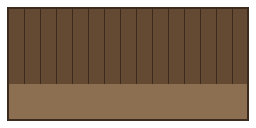<figcaption>south · 256 × 128</figcaption></figure>
  <figure class="art-tile">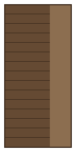<figcaption>west · 128 × 256</figcaption></figure>

  <code>#8C6E50</code> surface
  <code>#654A33</code> body
  <code>#3C2A1C</code> edge

### Gallows

3 × 2 tiles · [details](buildings.md#gallows)

  <figure class="art-tile art-wide">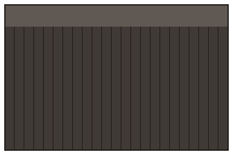<figcaption>north · 384 × 256 also the build-menu icon</figcaption></figure>
  <figure class="art-tile art-wide">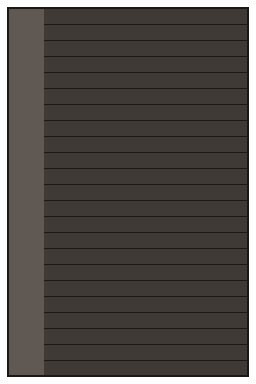<figcaption>east · 256 × 384</figcaption></figure>
  <figure class="art-tile art-wide">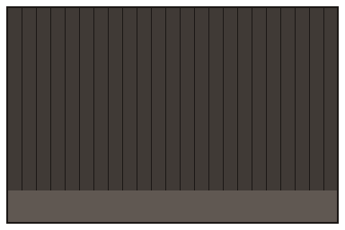<figcaption>south · 384 × 256</figcaption></figure>
  <figure class="art-tile art-wide">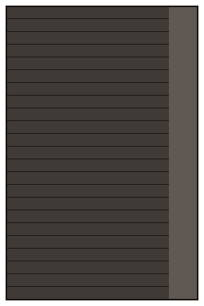<figcaption>west · 256 × 384</figcaption></figure>

The greyest palette in the set, on purpose — everything else here reads as warm wood.

  <code>#605852</code> surface
  <code>#403A36</code> body
  <code>#1C1816</code> edge

### Faro table

2 × 1 tiles · [details](buildings.md#faro-table)

  <figure class="art-tile">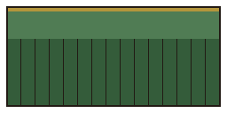<figcaption>north · 256 × 128 also the build-menu icon</figcaption></figure>
  <figure class="art-tile">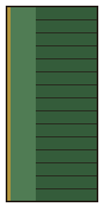<figcaption>east · 128 × 256</figcaption></figure>
  <figure class="art-tile">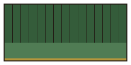<figcaption>south · 256 × 128</figcaption></figure>
  <figure class="art-tile">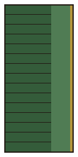<figcaption>west · 128 × 256</figcaption></figure>

Green baize for the body, with a gold accent stripe standing in for the dealing box.

  <code>#B4963C</code> accent (dealing box)
  <code>#507C54</code> surface
  <code>#345C3A</code> body
  <code>#221A14</code> edge

### Batwing doors

1 × 1 tile · [details](buildings.md#batwing-doors)

  <figure class="art-tile">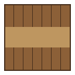<figcaption>north · 128 × 128 also the build-menu icon</figcaption></figure>
  <figure class="art-tile">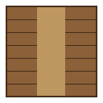<figcaption>east · 128 × 128</figcaption></figure>
  <figure class="art-tile">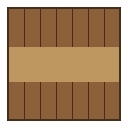<figcaption>south · 128 × 128</figcaption></figure>
  <figure class="art-tile">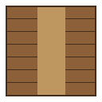<figcaption>west · 128 × 128</figcaption></figure>

The one tile in the set where the pale band sits in the **middle** rather than along the top —
the gap between the two swinging half-doors, not a counter's far side.

  <code>#BE9660</code> surface (the gap between the doors)
  <code>#8C6038</code> body
  <code>#462E1C</code> edge

### Boardwalk

A terrain tile, not a building — one fully-opaque 128 × 128 image with no facings, laid the way
any floor is.

  <figure class="art-tile">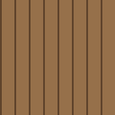<figcaption>128 × 128</figcaption></figure>

  <code>#96704A</code> body (planking)
  <code>#60442C</code> edge (plank seams)

## Mod listing

What the mod looks like in RimWorld's mod list and on the Workshop.

  <figure class="art-tile art-wide">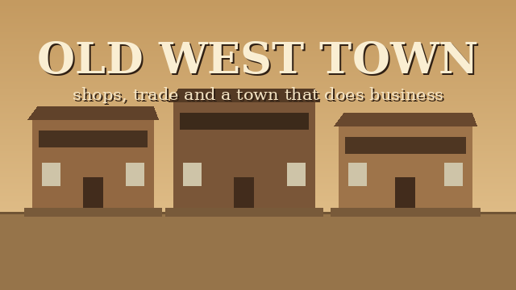<figcaption>640 × 360</figcaption></figure>

## How a building is drawn

Every building picture is the same five-step drawing in four colours, which is why a new building
needs a palette rather than an artist:

| Step | What it draws |
| --- | --- |
| 1 | A transparent border, so adjacent buildings don't visually fuse |
| 2 | A dark outline in the **edge** colour |
| 3 | A lighter band along the far edge, in the **surface** colour |
| 4 | The rest in the **body** colour, with an optional **accent** stripe just inside the top |
| 5 | Plank seams down the body, in the edge colour |

The seams are spaced so the last one lands exactly on the outline. That alignment is what makes a
long counter read as planks rather than as one flat slab.

**Terrain is simpler still.** A tile like the boardwalk is one fully-opaque square in just two
colours — a body and an edge for the plank seams — with no rotations to derive, since floors don't
face a direction.

Modders: the generator and its table of palettes are covered in
[contributing](contributing.md#generating-building-art).

## Items

**The mod adds no items of its own**, and therefore no item art. That is deliberate rather than
unfinished: a business sells whatever your colony already produces and whatever the base game
already defines, priced from [market value](economy.md#pricing). Adding bespoke trade goods would
mean adding a supply chain to make them, which is a different mod.

The one thing that changes hands and is *not* a shelf item is a [service](services.md) — a drink,
a meal, a haircut — and a service has nothing to draw, by definition. Its visible proof is the
effect it leaves behind: the buzz from a drink, a mood boost, or in the
[haircut's](services.md#haircut) case a new hairstyle.

## Everything else you see

For completeness, the visible surface that isn't a picture file:

| What | Where it comes from |
| --- | --- |
| Build-menu category icon | The game's default for a build category |
| Research tab entry | The game's default |
| **Open for business** button | The game's own "unforbid" icon |
| **Set prices** button | The game's own power-management icon |
| **Set house edge** button | The same power-management icon as **Set prices** — it's the same slider idiom, so it wears the same icon |
| **Collect takings** button | The silver icon |
| **Town ledger** button | The game's own info icon |
| Stock tab | The stockpile filter list, unmodified |
| Fresh-haircut mood, slept-at-the-hotel mood | No icon; the game draws mood thoughts from text |
| **Evict guest** button | The game's own "forbid" icon |

Reusing the game's own button icons is a choice, not a shortcut: you already know what the
unforbid icon means, and a bespoke icon for "open for business" would be one more thing to learn
for no gain.
